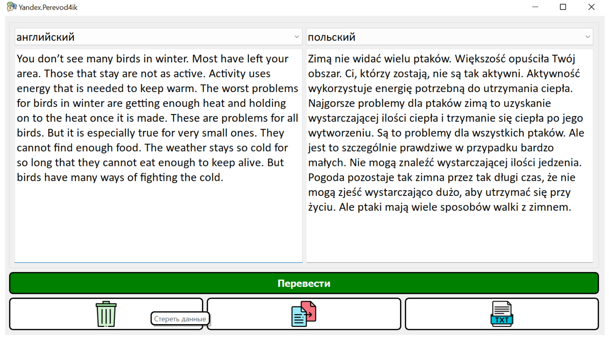

# Разработка собственной программы с графическим интерфейсом «Perevodchik»

## Скриншот


## Содержание

- [Установка](#установка)
- [Использование](#использование)

## Установка

Склонируйте репозиторий:
```sh
git clone https://github.com/katekatik/Perevodchik.git
```    

## Использование

Запустите проект (например, в PyCharm). 
!Программа функционирует корректно, однако из-за отсутствия доступа к API её возможности ограничены. 
    
    
